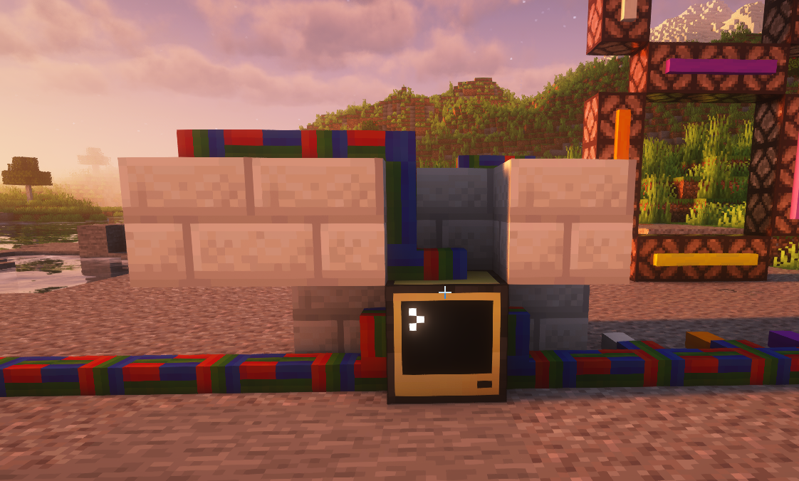
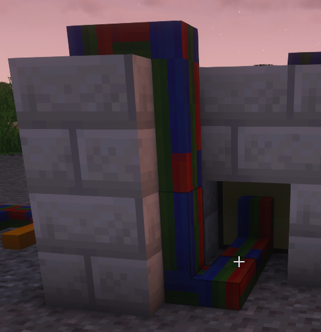

# ComputerCraft Minecraft Real Time Clock
A real time clock, that can be displayed on a 7 segment Redstone Lamp Display, using the Mods MoreRed and ComputerCraft. 

## Download startup.lua from pastebin

In the ComputerCraft Command Line just type:
`pastebin get https://pastebin.com/rCG5zpVx startup`

And then run it with:
`startup`

Now it always starts automatically (e.g. after Server Restart or if you restart the Computer).

## Setup Cables to Redstone Lamps

If you just want to use the code to build an easy working real time clock, you have to setup the cables like mine (you can also setup it like you want it, but then you have to adjust the code.)

My setup:

These are cables from MoreRed (I played on ATM 9). You have to connect the bundled cables with the Computer:

You have to be sure that the bundled cables from right, left, top and back aren´t connected.

